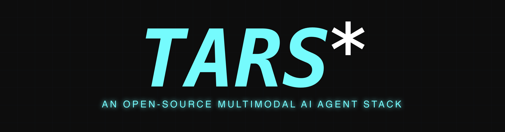

<picture>
  
</picture>

<br/>

<div align="center">

English | [简体中文](./README.md)

[](https://github.com/yingmingfeng/zhima/releases)
[](LICENSE)
[](https://github.com/yingmingfeng/zhima/stargazers)

</div>

<br/>

> A small sesame seed may seem insignificant, but it yields oil.
>
> A desktop operation may seem trivial, but it can be automated.

**Zhima (芝麻)** is a desktop GUI Agent that understands your screen through vision-language models and automates desktop operations via natural language.

Zhima is an independent evolution from [UI-TARS Desktop](https://github.com/bytedance/ui-tars-desktop) (ByteDance's open-source GUI Agent desktop application), built upon its core vision-language driven capabilities. UI-TARS provides a solid framework for computer operation through visual understanding, but as an open-source project its update pace has slowed. Zhima fixes the native build defects and follows its own development path.

> 📌 **Current status**: Zhima has just been created as a fork. It is functionally equivalent to upstream UI-TARS Desktop, with the main changes being build fixes and installer enhancements. Differentiating features such as workflow recording and vertical scenario deep-dives will be added gradually.

## Table of Contents

- [Key Differentiator](#key-differentiator)
- [Features](#features)
- [Quick Start](#quick-start)
- [Comparison with UI-TARS Desktop](#comparison-with-ui-tars-desktop)
- [Roadmap](#roadmap)
- [Contributing](#contributing)
- [License](#license)

## Key Differentiator

**Not an AI assistant — a desktop automation executor.**

Unlike general-purpose AI assistants, Zhima's core mission is enabling users to teach AI to execute complex, multi-step professional software workflows through **recording + human-in-the-loop intervention**.

| Scenario | Examples |
|----------|----------|
| 🎨 Professional Design | Photoshop batch processing, 3D modeling repetitive operations |
| 📄 Office Automation | Word/WPS batch formatting, Excel complex data workflows |
| 🏢 Enterprise Systems | Legacy systems without APIs, internal OA process automation |
| 🧪 Testing & QA | Desktop app automated testing, UI regression verification |

These scenarios share common traits: long operation chains, mechanically repetitive steps, but relatively fixed paths. Pure AI reasoning alone isn't reliable — but **human demonstration → AI learning → human correction** gradually solidifies them into automated workflows.

Advances in AI model capabilities are not a threat to Zhima — they are leverage. The stronger the models become, the more complex workflows they can understand and execute, and the broader the scenarios Zhima can cover. Those mechanical professional software operation workflows fundamentally carry industry-specific business knowledge, not general reasoning ability — the latter is what models excel at, and the former is exactly what Zhima aims to accumulate.

## Features

- 🤖 **Natural Language Control** — Describe what you need in plain language; the VLM understands your screen and acts
- 🖥️ **Visual Understanding** — Screenshot-based recognition, no API or DOM access needed
- 🎯 **Precise Desktop Control** — Mouse, keyboard, and UI element interaction via nut-js
- 💻 **Cross-Platform** — Windows & macOS support
- 🔄 **Real-Time Feedback** — Live status display and thought chain visualization
- 🔐 **Model Agnostic** — Supports OpenAI-compatible APIs, local models (Ollama/Qwen), private deployment
- 📦 **Workflow Recording** — Record, replay, and refine multi-step operation flows (planned)

## Quick Start

### Prerequisites

- Node.js >= 20.x
- pnpm >= 11.7.0

### Development

```bash
# Install dependencies (run from project root)
pnpm install

# Start development mode (hot reload)
cd apps/zhima && pnpm dev

# Type check
cd apps/zhima && pnpm typecheck

# Lint
pnpm lint
```

### Build & Package

```bash
# Production build + package installers
cd apps/zhima && pnpm build
cd apps/zhima && pnpm make
```

> 📖 See [Quick Start](./docs/quick-start.md) for detailed setup instructions.

## Comparison with UI-TARS Desktop

| Aspect | UI-TARS Desktop (Upstream) | Zhima |
|--------|---------------------------|-------|
| Build Stability | `bytecodePlugin` causes white screen in production | Fixed |
| Renderer Resource Path | Fails to load resources in production | Fixed (`base: './'`) |
| Windows Packaging | Squirrel installer only | Added NSIS with custom install path |
| Product Naming | Inconsistent (contains spaces) | Unified: `UI-TARS` |
| Update Cadence | Slowed down | Active maintenance |
| Target Focus | General GUI Agent research | **Workflow automation + enterprise scenarios** |

## Roadmap

```
Open Source Community Edition (Free)
  ├── Core Agent capabilities (mouse/keyboard, visual understanding) ✓
  ├── Workflow recording and replay (planned)
  ├── Local model support ✓
  └── Personal daily use

Enterprise Edition (Paid - Long-term)
  ├── Workflow template library (cloud sync & sharing)
  ├── Team collaboration
  ├── Private deployment + admin console
  └── Enterprise system integration
```

## Contributing

Contributions are welcome! Please read [CONTRIBUTING.md](./CONTRIBUTING.md) for guidelines.

## License

This project is licensed under the Apache License 2.0.

---

*Built upon [UI-TARS Desktop](https://github.com/bytedance/ui-tars-desktop) (commit `7986f5a`), relicensed under Apache 2.0.*
