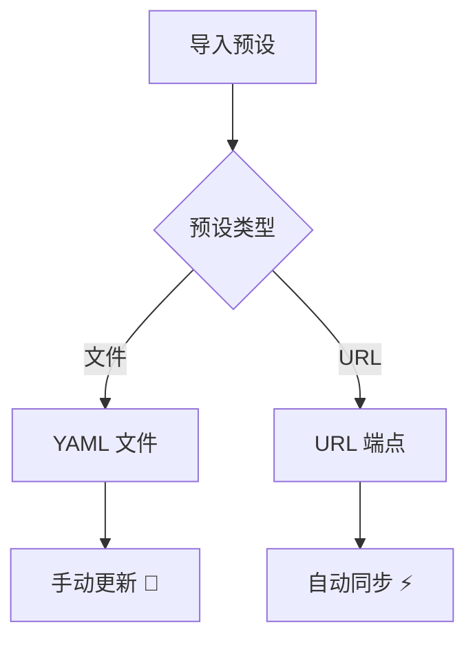
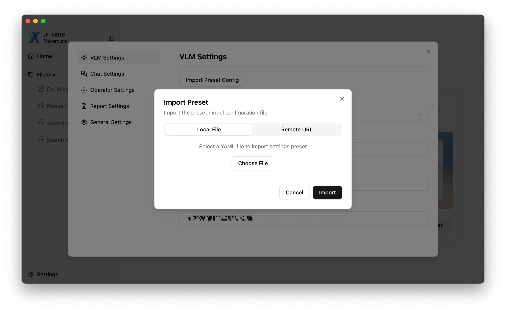
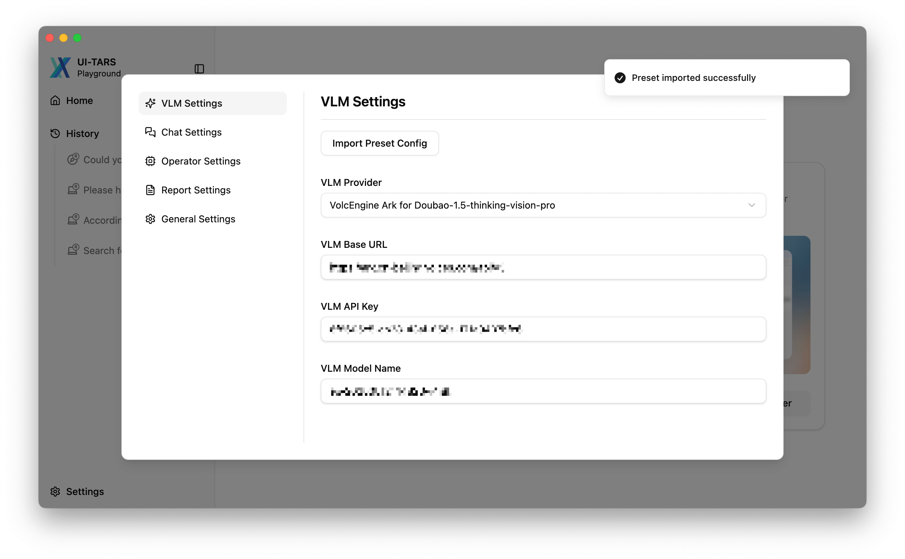
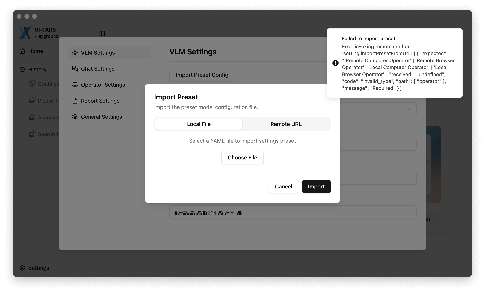
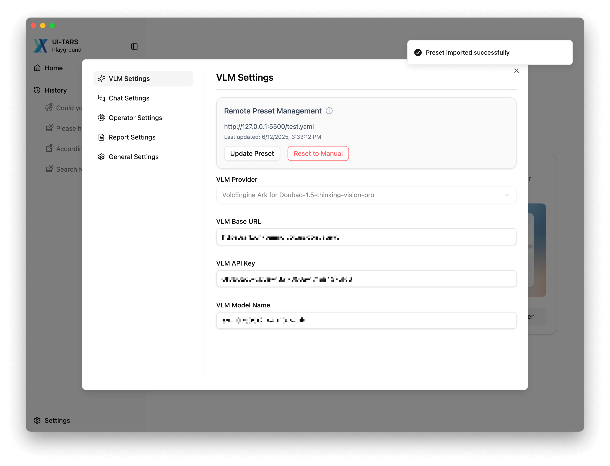

# 预设管理指南

> [!IMPORTANT]  
> 目前，**芝麻 (Zhima)** 不直接提供服务端能力，因此我们暂未为开源社区提供预设。欢迎社区开发者在此处贡献你的预设：[examples/presets](../examples/presets/)。

**预设** 是 [设置](./setting.md) 的集合（在 [#61](https://github.com/yingmingfeng/zhima/pull/61) 中引入），**芝麻 (Zhima)** 支持通过 `文件` 或 `URL` 导入预设：



<br>


## 预设类型对比

| 功能                 | 本地预设              | 远程预设              |
|----------------------|-----------------------|-----------------------|
| **存储方式**         | 设备本地              | 云端托管              |
| **更新机制**         | 手动                  | 自动                  |
| **访问控制**         | 读/写                 | 只读                  |
| **版本管理**         | 手动                  | Git 集成              |


<br>


## 示例

### 从文件导入

**芝麻 (Zhima)** 支持从文件导入预设。文件解析成功后，设置将自动更新。

| 功能 | 截图 |
| --- | ---|
| 打开设置 | |
| 导入成功 | |
| 异常：无效内容 |  |


<br>


### 从 URL 导入

**芝麻 (Zhima)** 也支持从 URL 导入预设。如果设置了自动更新，每次启动应用时将自动拉取预设。

| 功能 | 截图 |
| --- | ---|
| 打开设置 |  |
| 导入成功（默认） |  |


<br>


### 预设示例

```yaml
name: UI TARS Desktop Example Preset
language: en
vlmProvider: Hugging Face for UI-TARS-1.5
vlmBaseUrl: https://your-endpoint.huggingface.cloud/v1
vlmApiKey: your_api_key
vlmModelName: your_model_name
reportStorageBaseUrl: https://your-report-storage-endpoint.com/upload
utioBaseUrl: https://your-utio-endpoint.com/collect
```

查看所有 [预设示例](../examples/presets)。

