# 快速开始

欢迎使用芝麻 (Zhima)！本指南将帮助您快速下载、安装和配置桌面端。

芝麻支持 **Computer Operator**（桌面操控）与 **Browser Operator**（浏览器操控）两种模式，兼容多种 VLM 模型后端。

<br />

## 环境要求

**Browser Operator** 模式需要安装 **Chrome**（[stable](https://www.google.com/chrome/)/[beta](https://www.google.com/chrome/beta/)/[dev](https://www.google.com/chrome/dev/)/[canary](https://www.google.com/chrome/canary/)）、**Edge**（[stable](https://www.microsoft.com/en-us/edge/download)/[beta/dev/canary](https://www.microsoft.com/en-us/edge/download/insider)）或 **Firefox**（[stable](https://www.mozilla.org/en-US/firefox/new/)/[beta/dev/nightly](https://www.mozilla.org/zh-CN/firefox/channel/desktop/)）。

芝麻目前仅支持单显示器环境。多显示器配置可能导致部分任务失败。

<br />

## 下载

从 [Releases 页面](https://github.com/yingmingfeng/zhima/releases/latest) 下载芝麻最新版本的安装包。

<br />

## 安装

### MacOS

1. 将 **UI TARS** 应用拖入 **Applications** 文件夹
   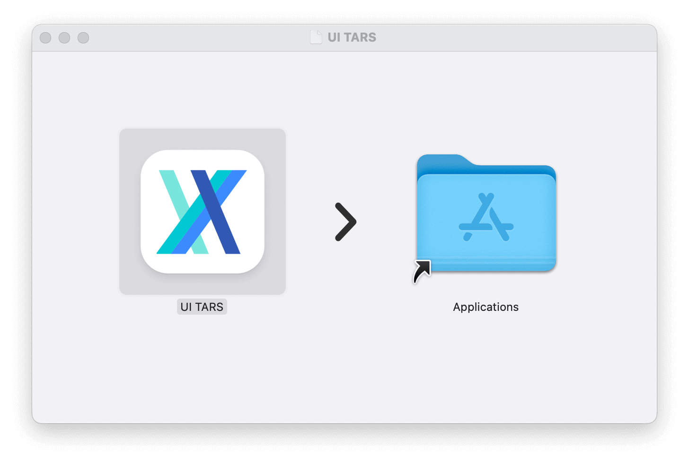

2. 在 MacOS 中授予 **UI TARS** 必要权限：
   - 系统设置 -> 隐私与安全性 -> **辅助功能**
   - 系统设置 -> 隐私与安全性 -> **屏幕录制**
   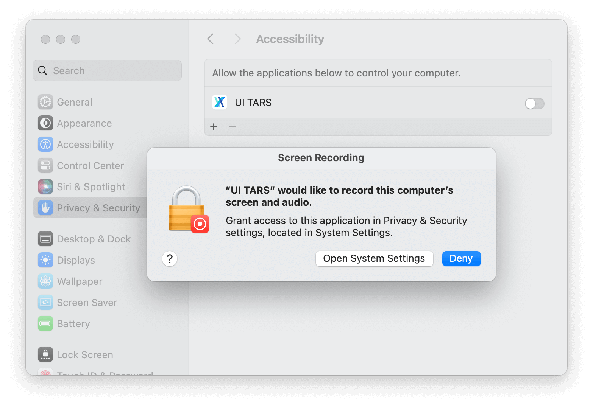

3. 打开 **UI TARS** 应用，您将看到如下界面：
   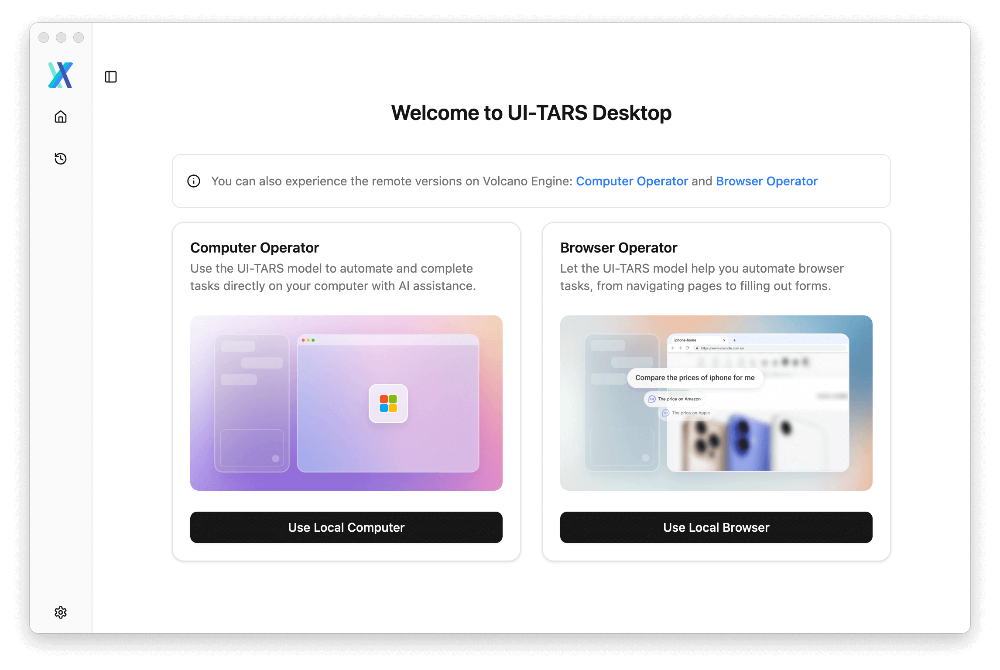

### Windows

**直接运行** 应用，您将看到如下界面：

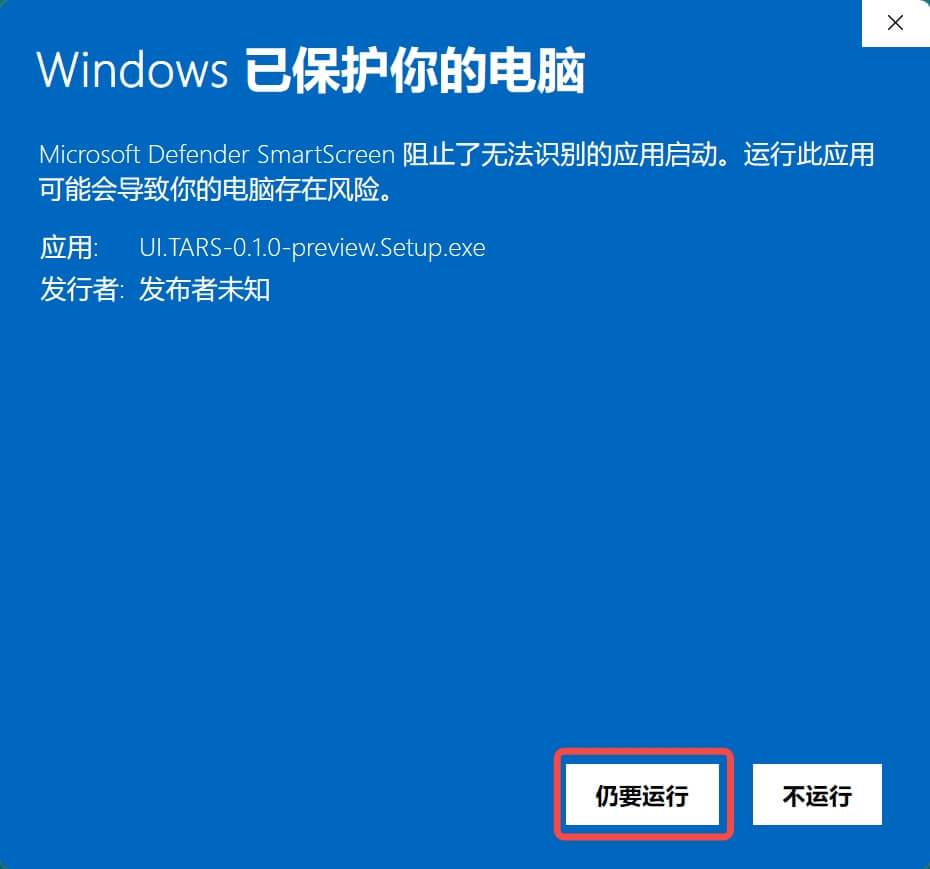

<br />

## 获取模型并运行本地操作器

### 在 [Hugging Face](https://endpoints.huggingface.co/catalog) 上使用 UI-TARS-1.5

1. 在页面右上角点击 `Deploy from Hugging Face` 按钮
   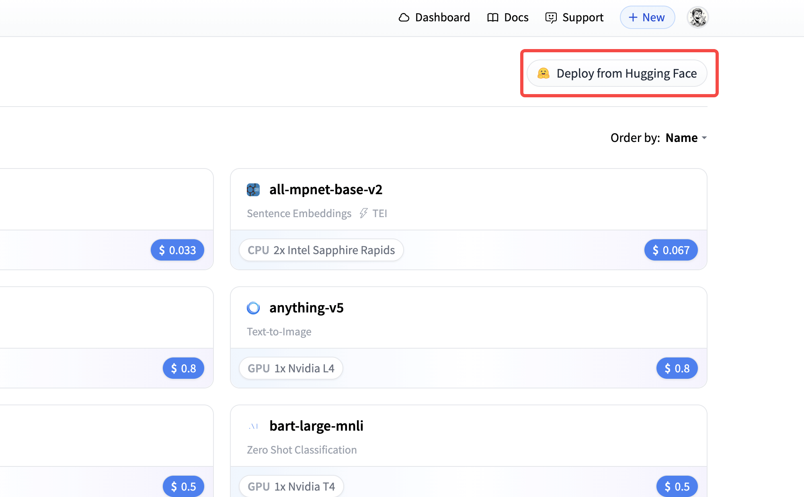

2. 选择模型 UI-TARS-1.5-7B
   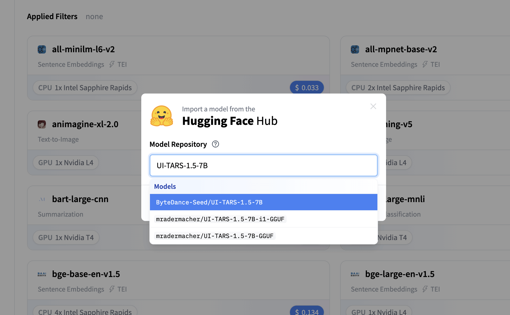

3. 参考 [README_deploy.md](https://github.com/bytedance/UI-TARS/blob/main/README_deploy.md) 获取详细部署说明，以获取 **Base URL**、**API Key** 和 **Model Name**。

4. 打开芝麻的[设置页面](./setting.md)并配置：

```yaml
Language: en
VLM Provider: Hugging Face for UI-TARS-1.5
VLM Base URL: https://xxx
VLM API KEY: your_api_key
VLM Model Name: xxx
```

> [!NOTE]
> 1. VLM Provider 务必选择 "**Hugging Face for UI-TARS-1.5**"，以确保 VLM 动作解析正常运作。
> 2. 可在 Hugging Face Endpoint 页面查看详细的 Base URL 与 Model Name 信息。请确保 Base URL 以 '/v1/' 结尾。
>
> 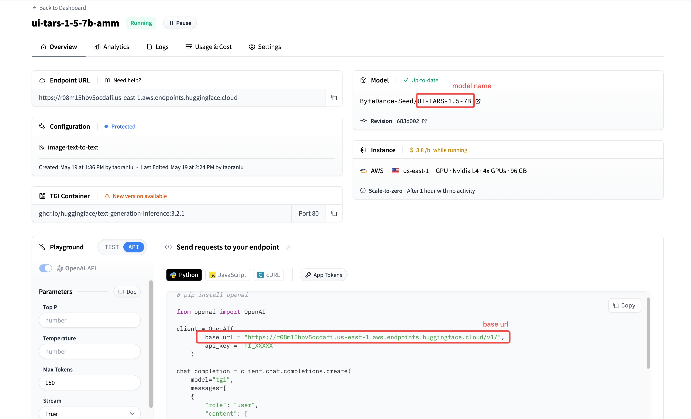

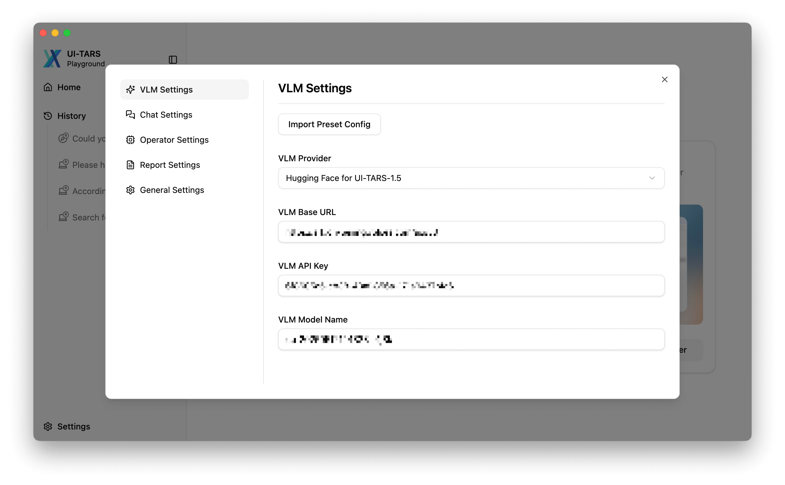

5. 点击按钮开始新对话

   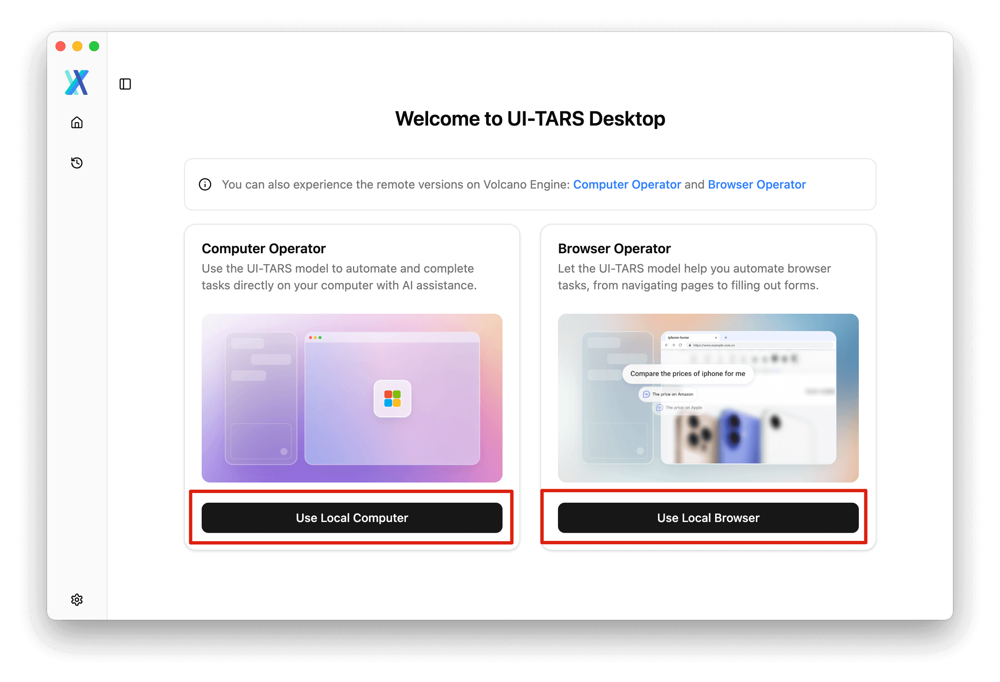

6. 输入指令，开始一轮 GUI 操作任务！

   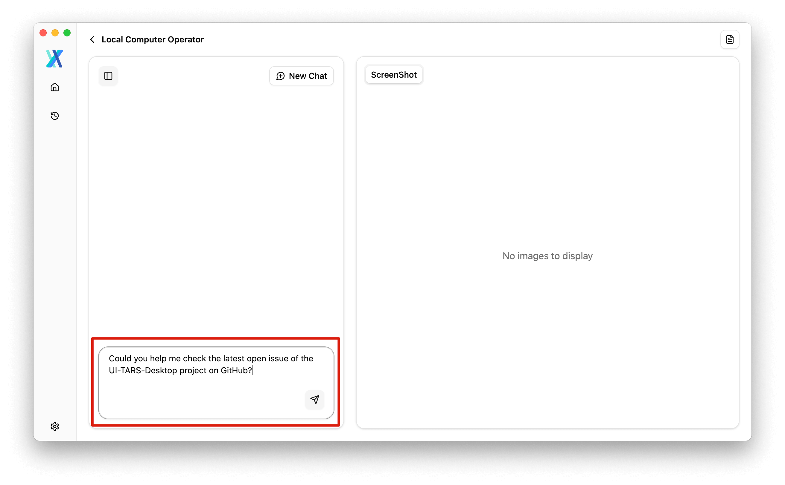

<br />

### 在 [火山引擎](https://console.volcengine.com/ark/region:ark+cn-beijing/model/detail?Id=doubao-1-5-ui-tars) 上使用 Doubao-1.5-UI-TARS

1. 访问[火山引擎 Doubao-1.5-UI-TARS 页面](https://console.volcengine.com/ark/region:ark+cn-beijing/model/detail?Id=doubao-1-5-ui-tars)

2. 点击页面右上角的`立即体验`按钮
   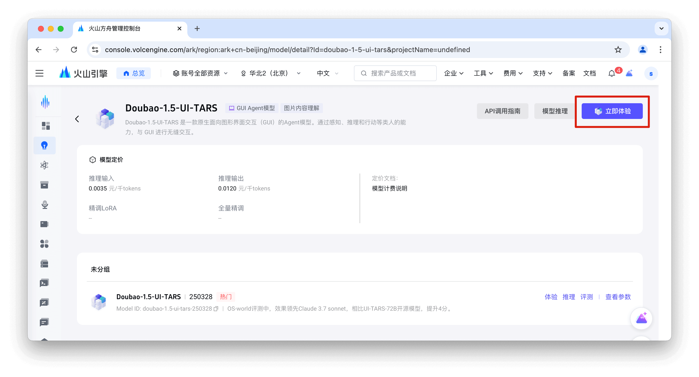

3. 点击 `API 接入` 链接
   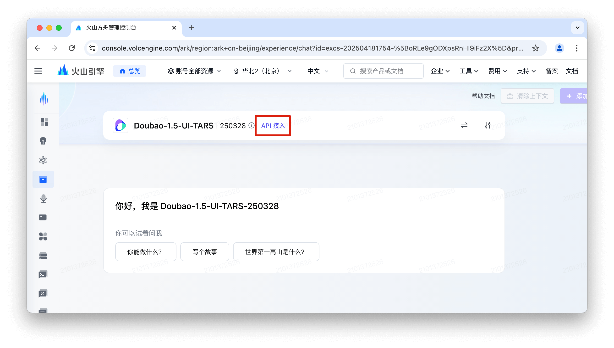

4. 在抽屉面板的 STEP 1 中获取您的 **API Key**
   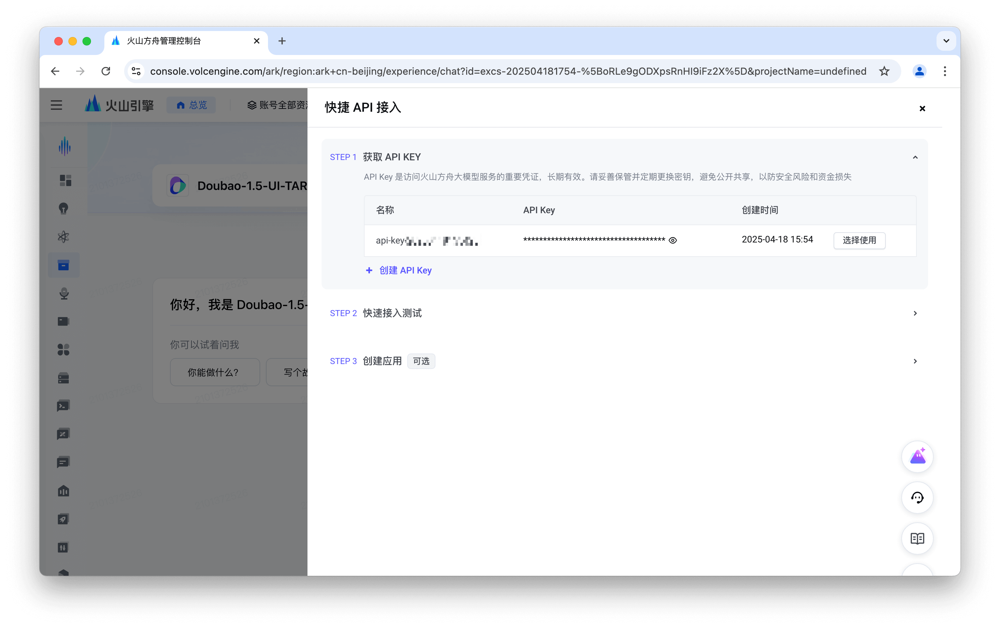

5. 在 STEP 2 中完成用户信息认证，切换到 OpenAI SDK 选项卡以获取 **Base URL** 和 **Model Name**：
   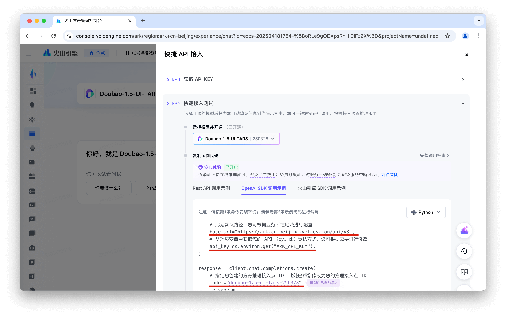

6. 打开芝麻的[设置页面](./setting.md)并配置：

```yaml
Language: cn
VLM Provider: VolcEngine Ark for Doubao-1.5-UI-TARS
VLM Base URL: https://ark.cn-beijing.volces.com/api/v3
VLM API KEY: YOUR_API_KEY
VLM Model Name: doubao-1.5-ui-tars-250328
```

> [!NOTE]
> VLM Provider 务必选择 "**VolcEngine Ark for Doubao-1.5-UI-TARS**"，以确保 VLM 动作解析正常运作。

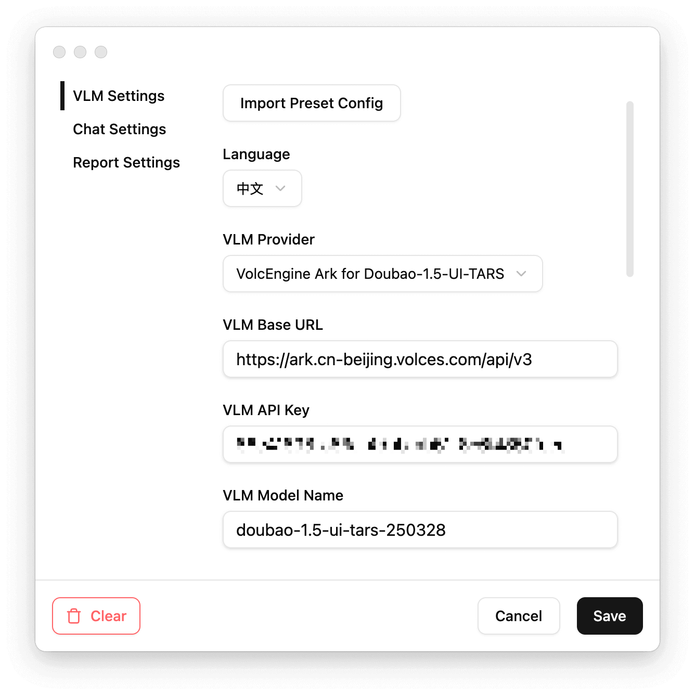

7. 开始新对话前选择所需的使用场景

   

> [!NOTE]
> 使用 `Browser Operator` 模式前，请确保您的设备已安装 Chrome、Edge 或 Firefox。

8. 输入指令，开始一轮 GUI 操作任务！

   

<br />

## 了解更多

到此为止，您应该已经成功启动了芝麻桌面端！为了更好地使用芝麻并确保稳定运行，建议查阅以下文档：

- 阅读[设置配置指南](./setting.md)，配置 VLM/Chat 参数。选择合适的 VLM Provider 可以优化桌面端的模型使用性能。
- 阅读 [UI-TARS-1.5 部署指南](https://github.com/bytedance/UI-TARS/blob/main/README_deploy.md)，了解 UI-TARS-1.5 的最新部署方式。
- 阅读 [UI-TARS 模型部署教程](https://bytedance.sg.larkoffice.com/docx/TCcudYwyIox5vyxiSDLlgIsTgWf)，了解 Doubao-1.5-UI-TARS 的最新部署方式。
