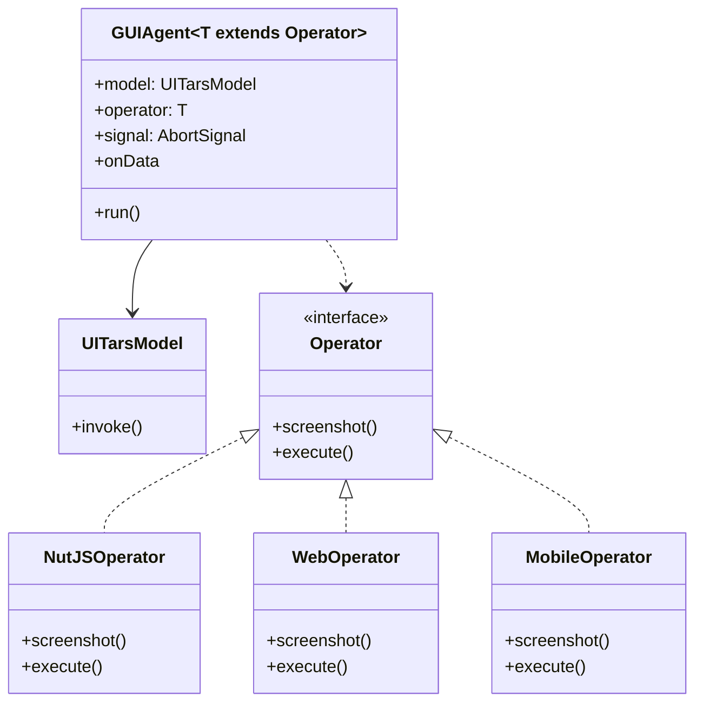
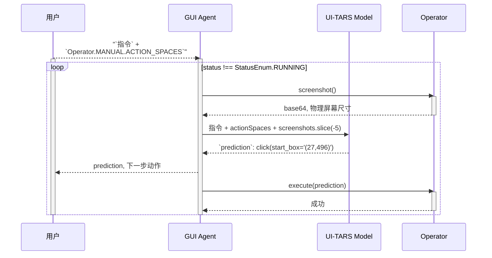
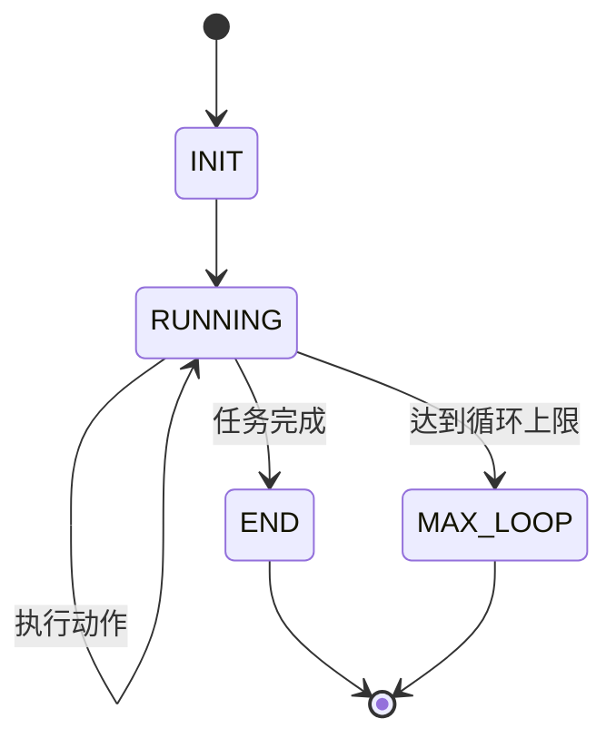

# @zhima/sdk 指南（实验性）

[](https://www.npmjs.com/package/@zhima/sdk) [](https://app.codecov.io/gh/bytedance/UI-TARS-desktop/components/ui_tars_sdk)

## 概述

`@zhima/sdk` 是一个强大的跨平台（任何设备/平台）工具包，用于构建 GUI 自动化 Agent。

它提供了一个灵活的框架，用于创建能够通过各种 Operator 与图形用户界面交互的 Agent。支持在 **Node.js** 和 **Web 浏览器** 上运行。



## 快速体验

```bash
npx @zhima/cli start
```

输入你的 UI-TARS 模型服务配置（`baseURL`、`apiKey`、`model`），即可通过 CLI 控制你的计算机。

```
Need to install the following packages:
Ok to proceed? (y) y

│
◆  Input your instruction
│  _ Open Chrome
└
```

## Agent 执行流程




### 基础用法

基础用法主要源自 `@zhima/sdk` 包，以下是使用 SDK 的基本示例：

> 注意：使用 `nut-js`（跨平台计算机控制工具）作为 Operator，你也可以使用或自定义其他 Operator。NutJS Operator 支持的常见桌面自动化操作：
> - 鼠标操作：单击、双击、右键单击、拖拽、悬停
> - 键盘输入：打字、快捷键
> - 滚动
> - 截图

```ts
import { GUIAgent } from '@zhima/sdk';
import { NutJSOperator } from '@zhima/operator-nut-js';

const guiAgent = new GUIAgent({
  model: {
    baseURL: config.baseURL,
    apiKey: config.apiKey,
    model: config.model,
  },
  operator: new NutJSOperator(),
  onData: ({ data }) => {
    console.log(data)
  },
  onError: ({ data, error }) => {
    console.error(error, data);
  },
});

await guiAgent.run('send "hello world" to x.com');
```

### 处理中止信号

你可以通过向 GUIAgent 的 `signal` 选项传递 `AbortSignal` 来中止 Agent。

```ts
const abortController = new AbortController();

const guiAgent = new GUIAgent({
  // ... 其他配置
  signal: abortController.signal,
});

// ctrl/cmd + c 取消操作
process.on('SIGINT', () => {
  abortController.abort();
});
```

## 配置选项

`GUIAgent` 构造函数接受以下配置选项：

- `model`：模型配置（兼容 OpenAI API）或自定义模型实例
  - `baseURL`：API 端点 URL
  - `apiKey`：API 认证密钥
  - `model`：使用的模型名称
  - 更多选项参见 [OpenAI API](https://platform.openai.com/docs/guides/vision/uploading-base-64-encoded-images)
- `operator`：实现所需接口的 Operator 类实例
- `signal`：用于取消操作的 AbortController 信号
- `onData`：接收 Agent 数据/状态更新的回调
  - `data.conversations` 是一个对象数组，**重要：这是增量数据，不是完整的对话历史**，每个对象包含：
    - `from`：消息角色，可以是以下值之一：
      - `human`：用户消息
      - `gpt`：Agent 响应
      - `screenshotBase64`：截图 base64
    - `value`：消息内容
  - `data.status` 是 Agent 的当前状态，可以是以下值之一：
    - `StatusEnum.INIT`：初始状态
    - `StatusEnum.RUNNING`：Agent 正在执行中
    - `StatusEnum.END`：操作完成
    - `StatusEnum.MAX_LOOP`：达到最大循环次数
- `onError`：错误处理回调
- `systemPrompt`：可选的系统提示词
- `maxLoopCount`：最大交互循环次数（默认：25）

### 状态流转



## 高级用法

### Operator 接口

在实现自定义 Operator 时，需要实现两个核心方法：`screenshot()` 和 `execute()`。

#### 初始化

使用 `npm init` 创建新的 Operator 包，配置如下：

```json
{
  "name": "your-operator-tool",
  "version": "1.0.0",
  "main": "./dist/index.js",
  "module": "./dist/index.mjs",
  "types": "./dist/index.d.ts",
  "scripts": {
    "dev": "rslib build --watch",
    "prepare": "npm run build",
    "build": "rsbuild",
    "test": "vitest"
  },
  "files": [
    "dist"
  ],
  "publishConfig": {
    "access": "public",
    "registry": "https://registry.npmjs.org"
  },
  "dependencies": {
    "jimp": "^1.6.0"
  },
  "peerDependencies": {
    "@zhima/sdk": "^1.2.0-beta.17"
  },
  "devDependencies": {
    "@zhima/sdk": "^1.2.0-beta.17",
    "@rslib/core": "^0.5.4",
    "typescript": "^5.7.2",
    "vitest": "^3.0.2"
  }
}
```

#### screenshot()

此方法捕获当前屏幕状态并返回一个 `ScreenshotOutput`：

```typescript
interface ScreenshotOutput {
  // Base64 编码的图片字符串
  base64: string;
  // 设备像素比 (DPR)
  scaleFactor: number;
}
```

#### execute()

此方法根据模型预测执行操作。它接收一个 `ExecuteParams` 对象：

```typescript
interface ExecuteParams {
  /** 模型返回的原始预测字符串 */
  prediction: string;
  /** 解析后的预测对象 */
  parsedPrediction: {
    action_type: string;
    action_inputs: Record<string, any>;
    reflection: string | null;
    thought: string;
  };
  /** 设备物理分辨率 */
  screenWidth: number;
  /** 设备物理分辨率 */
  screenHeight: number;
  /** 设备 DPR */
  scaleFactor: number;
  /** 模型坐标缩放因子 [widthFactor, heightFactor] */
  factors: Factors;
}
```

高级 SDK 用法主要源自 `@zhima/sdk/core` 包，你可以通过扩展基础 `Operator` 类来创建自定义 Operator：

```typescript
import {
  Operator,
  type ScreenshotOutput,
  type ExecuteParams
  type ExecuteOutput,
} from '@zhima/sdk/core';
import { Jimp } from 'jimp';

export class CustomOperator extends Operator {
  // 定义 UI-TARS 系统提示词拼接所需的动作空间和描述
  static MANUAL = {
    ACTION_SPACES: [
      'click(start_box="") # 在指定坐标位置点击元素',
      'type(content="") # 在当前输入框中输入指定内容',
      'scroll(direction="") # 沿指定方向滚动页面',
      'finished() # 完成任务',
      // ...更多动作
    ],
  };

  public async screenshot(): Promise<ScreenshotOutput> {
    // 实现截图功能
    const base64 = 'base64-encoded-image';
    const buffer = Buffer.from(base64, 'base64');
    const image = await sharp(buffer).toBuffer();

    return {
      base64: 'base64-encoded-image',
      scaleFactor: 1
    };
  }

  async execute(params: ExecuteParams): Promise<ExecuteOutput> {
    const { parsedPrediction, screenWidth, screenHeight, scaleFactor } = params;
    // 实现动作执行逻辑

    // 如果是点击动作，从 parsedPrediction 中获取坐标
    const [startX, startY] = parsedPrediction?.action_inputs?.start_coords || '';

    if (parsedPrediction?.action_type === 'finished') {
      // 结束 GUIAgent 任务
      return { status: StatusEnum.END };
    }
  }
}
```

必需方法：
- `screenshot()`：捕获当前屏幕状态
- `execute()`：根据模型预测执行请求的操作

可选的静态属性：
- `MANUAL`：定义 UI-TARS 模型理解所需的动作空间和描述
  - `ACTION_SPACES`：定义 UI-TARS 模型理解所需的动作空间和描述

加载到 `GUIAgent` 中：

```ts
const guiAgent = new GUIAgent({
  // ... 其他配置
  systemPrompt: `
  // ... 其他系统提示词
  ${CustomOperator.MANUAL.ACTION_SPACES.join('\n')}
  `,
  operator: new CustomOperator(),
});
```

### 自定义模型实现

你可以通过扩展 `UITarsModel` 类来实现自定义模型逻辑：

```typescript
class CustomUITarsModel extends UITarsModel {
  constructor(modelConfig: { model: string }) {
    super(modelConfig);
  }

  async invoke(params: any) {
    // 实现自定义模型逻辑
    return {
      prediction: 'action description',
      parsedPredictions: [{
        action_type: 'click',
        action_inputs: { /* ... */ },
        reflection: null,
        thought: 'reasoning'
      }]
    };
  }
}

const agent = new GUIAgent({
  model: new CustomUITarsModel({ model: 'custom-model' }),
  // ... 其他配置
});
```

> 注意：不建议实现自定义模型，因为它包含大量的数据处理逻辑（包括图像变换、缩放因子等）。

### 规划

你可以结合规划/推理模型（如 OpenAI-o1、DeepSeek-R1）来实现复杂的 GUIAgent 规划、推理和执行逻辑：

```ts
const guiAgent = new GUIAgent({
  // ... 其他配置
});

const planningList = await reasoningModel.invoke({
  conversations: [
    {
      role: 'user',
      content: 'buy a ticket from beijing to shanghai',
    }
  ]
})
/**
 * [
 *  'open chrome',
 *  'open trip.com',
 *  'click "search" button',
 *  'select "beijing" in "from" input',
 *  'select "shanghai" in "to" input',
 *  'click "search" button',
 * ]
 */

for (const planning of planningList) {
  await guiAgent.run(planning);
}
```


