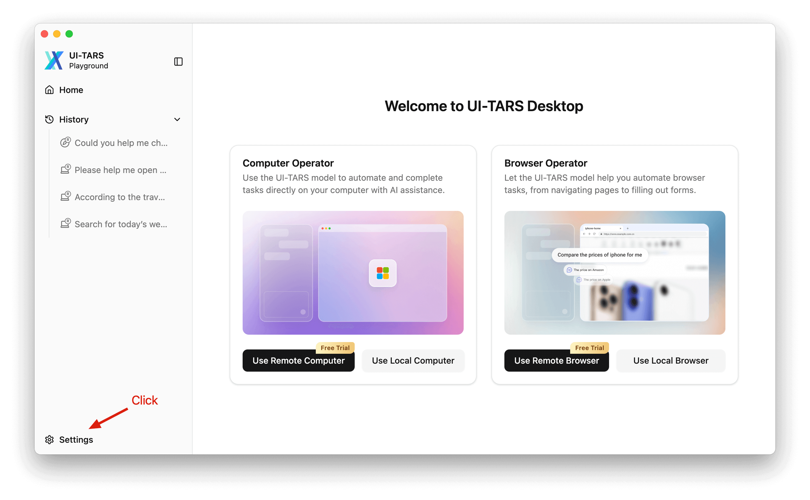
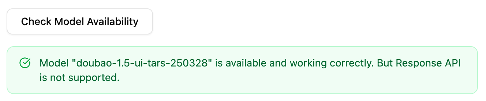
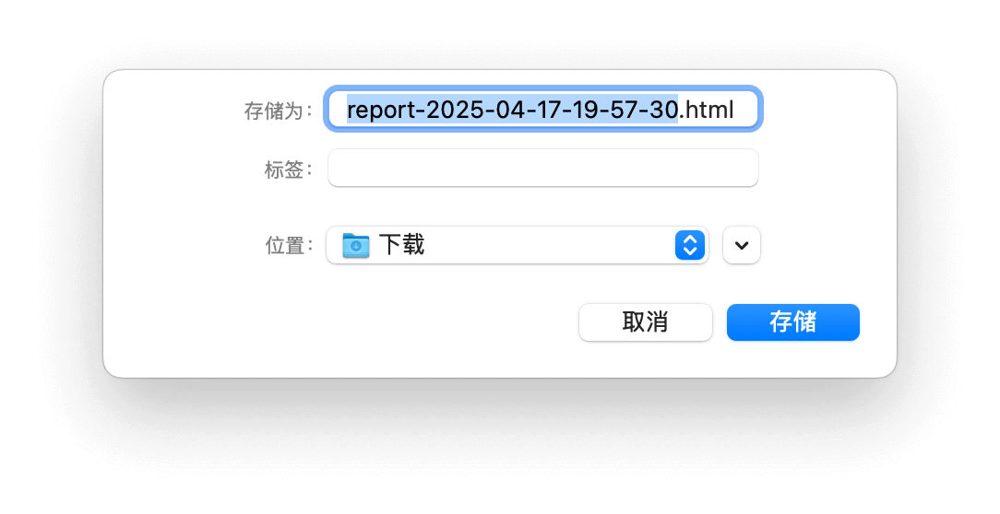
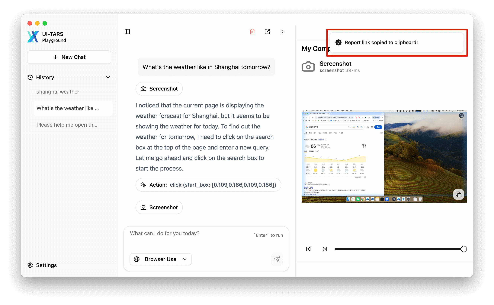
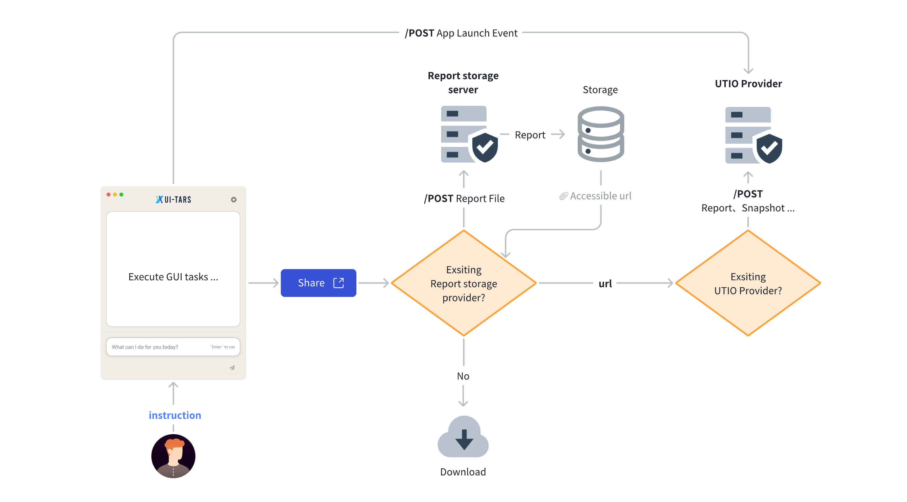

# 设置配置指南

## 概述

**芝麻 (Zhima)** 通过其设置系统提供了对应用程序行为的细粒度控制。本文档提供了关于配置选项、预设管理和操作最佳实践的全面指南。

<p align="center">
  
  <br>
  <em>主设置界面</em>
</p>


<br>


## 配置选项

### VLM 设置

#### VLM 提供商

选择后端 VLM 提供商，以确保更准确地执行 GUI 操作。此选项可以提升模型的性能。

| 属性       | 详情                |
| ----------- | ---------------------- |
| **类型**    | `string`               |
| **选项**    | - `Hugging Face for UI-TARS-1.0`<br /> - `Hugging Face for UI-TARS-1.5`<br /> - `VolcEngine Ark for Doubao-1.5-UI-TARS`<br /> - `VolcEngine Ark for Doubao-1.5-thinking-vision-pro` |
| **必填**    | `true`         |

> [!NOTE]
> 这是一个为不同 VLM 提供商预留的接口。


<br>


#### VLM Base URL

指定需要请求的 VLM 的 base URL。

关于 UI TARS 部署，请查阅[部署文档](./deployment.md)。

| 属性       | 详情  |
| ------------ | -------- |
| **类型**     | `string` |
| **必填**     | `true`   |

> [!NOTE]
> VLM Base URL 应为兼容 OpenAI API 的端点（更多详情请参阅 [OpenAI API 协议文档](https://platform.openai.com/docs/guides/vision/uploading-base-64-encoded-images)）。


<br>

#### VLM API KEY

指定 VLM API 密钥。

| 属性       | 详情  |
| ------------ | -------- |
| **类型**     | `string` |
| **必填**     | `true`   |


<br>


#### VLM Model Name

指定请求的模型名称。

| 属性       | 详情  |
| ------------ | -------- |
| **类型**     | `string` |
| **必填**     | `true`   |


<br>

#### 检查模型可用性

完成配置后，您可以点击 `检查模型可用性` 按钮来验证 VLM 模型是否可用。

<p align="center">
  
  <br>
  <em>主设置界面</em>
</p>


#### 使用 Responses API

如果模型支持 Responses API，您可以启用此选项。启用后将减少总体 token 消耗并提高响应速度。


#### 🌟 示例

在 [UI-TARS/README_deploy.md](https://github.com/bytedance/UI-TARS/blob/main/README_deploy.md#python-test-code) 的 HuggingFace 示例中，VLM 参数如下：

```yaml
Language: en
VLM Provider: Hugging Face for UI-TARS-1.5
VLM Base URL: https:xxx
VLM API KEY: hf_xxx
VLM Model Name: tgi
```

<br>

在 [Doubao-1.5-UI-TARS](https://console.volcengine.com/ark/region:ark+cn-beijing/model/detail?Id=doubao-1-5-ui-tars) 的 VolcEngine（火山引擎）示例中，VLM 参数如下：

```yaml
Language: cn
VLM Provider: VolcEngine Ark for Doubao-1.5-UI-TARS
VLM Base URL: https://ark.cn-beijing.volces.com/api/v3
VLM API KEY: ARK_API_KEY
VLM Model Name: doubao-1.5-ui-tars-250328
```

### 聊天设置


#### Language

控制 VLM 的本地化设置。

| 属性       | 详情                        |
| ----------- | ------------------------------ |
| **类型**    | `string`                       |
| **选项** | `en`（英文）, `zh`（中文） |
| **默认值** | `en`                           |

> [!NOTE]
> 更改设置**仅**会影响 VLM 的输出语言，不会影响应用程序本身的语言。关于应用程序本身的国际化（i18n），欢迎贡献 PR。


<br>


#### 最大循环

每轮对话的最大步骤数。

| 属性       | 详情  |
| ------------ | -------- |
| **类型**     | `number` |
| **必填**     | `true`   |
| **选项**  | `[25, 200]` |
| **默认值**  | `100`    |


<br>

#### 循环等待时间

每次循环的等待时间。

对于需要时间完成的交互操作，此参数在截图前添加延迟，确保最终状态被正确记录。


| 属性       | 详情  |
| ------------ | -------- |
| **类型**     | `number` |
| **必填**     | `true`   |
| **选项**  | `[0, 3000]` |
| **默认值**  | `1000`   |


<br>


### 操作器设置

#### 本地浏览器操作器搜索引擎

| 属性       | 详情                        |
| ----------- | ------------------------------ |
| **类型**    | `string`                       |
| **选项** | `Google`, `Bing`, `Baidu`      |
| **默认值** | `Google`                       |


<br>

### 报告设置

> [!TIP]
> 此配置部分为可选。这些设置主要用于使用分析和遥测收集，以改善用户体验。

#### 报告存储 Base URL

定义用于上传报告文件的 Base URL。 默认情况下，当未设置此选项时，用户点击 **导出为 HTML**（也称为 <b>分享</b>），将自动触发报告文件的下载：

<p align="center">
  
  <br>
</p>

设置后，当用户点击 **导出为 HTML** 时，将弹出一个窗口询问您。如果您选择"**是，继续！**"，报告文件将直接上传。等待几秒后，将出现提示通知，告知您报告链接已复制到剪贴板。

<p align="center">
  
  <br>
</p>

##### 报告存储服务器接口

报告存储服务器应实现以下 HTTP API 端点：

| 属性       | 详情                                                                                                      |
| ------------ | ------------------------------------------------------------------------------------------------------------ |
| **端点** | `POST /your-storage-enpoint`                                                                                 |
| **请求头**  | Content-Type: `multipart/form-data` <br> <!-- - Authorization: Bearer \<access_token\> (Not Supported) --> |

##### 请求体

请求应以 `multipart/form-data` 格式发送，包含以下字段：

| 字段 | 类型 | 必填 | 描述      | 限制                        |
| ----- | ---- | -------- | ---------------- | ---------------------------------- |
| file  | File | 是      | HTML 报告文件 | - 格式：HTML<br>- 最大大小：30MB |

##### 响应

**成功响应（200 OK）**
```json
{
  "url": "https://example.com/reports/xxx.html"
}
```

响应应返回一个 JSON 对象，其中包含一个可公开访问的报告 URL。

> [!NOTE]
> 目前，报告存储服务器没有设计认证机制。如果您有相关需求，请提交 [issue](https://github.com/yingmingfeng/zhima/issues)。


<br>


#### UTIO Base URL

**UTIO**（_UI-TARS Insights and Observation_）是一个数据收集机制，用于洞察 **芝麻 (Zhima)**（_介绍于 [#60](https://github.com/yingmingfeng/zhima/pull/60)_）。 UTIO 的设计也与分享相关。整体流程如下：

<p align="center">
  
  <br>
  <em>UTIO 流程图</em>
</p>

此选项定义了处理应用程序事件和指令的 **UTIO** 服务器的 Base URL。


##### 服务器接口规范

UTIO 服务器通过 HTTP POST 请求接收事件，支持三种事件类型：

| 属性       | 详情                          |
| ------------ | -------------------------------- |
| **端点** | `POST /your-utio-endpoint`       |
| **请求头**  | Content-Type: `application/json` |

##### 事件类型

服务器处理三种类型的事件：

###### **应用启动**
```typescript
interface AppLaunchedEvent {
  type: 'appLaunched';
  /** 平台类型 */
  platform: string;
  /** 操作系统版本，例如 "major.minor.patch" 格式 */
  osVersion: string;
  /** 屏幕宽度（像素） */
  screenWidth: number;
  /** 屏幕高度（像素） */
  screenHeight: number;
}
```

###### **发送指令**
```typescript
interface SendInstructionEvent {
  type: 'sendInstruction';
  /** 用户提交的指令内容 */
  instruction: string;
}
```

###### **分享报告**
```typescript
interface ShareReportEvent {
  type: 'shareReport';
  /** 可选的最后截图 URL 或 base64 内容 */
  lastScreenshot?: string;
  /** 可选的报告 URL */
  report?: string;
  /** 相关指令 */
  instruction: string;
}
```

##### 请求示例

```json
{
  "type": "appLaunched",
  "platform": "iOS",
  "osVersion": "16.0.0",
  "screenWidth": 390,
  "screenHeight": 844
}
```

##### 响应

**成功响应（200 OK）**
```json
{
  "success": true
}
```

> [!NOTE]
> 所有事件均为异步处理。服务器应及时响应以确认收到事件。


##### 服务器示例

###### Node.js

```js
const express = require('express');
const cors = require('cors');
const app = express();
const port = 3000;

app.use(cors());
app.use(express.json());

app.post('/your-utio-endpoint', (req, res) => {
  const event = req.body;
  
  if (!event || !event.type) {
    return res.status(400).json({ error: 'Missing event type' });
  }

  switch (event.type) {
    case 'appLaunched':
      return handleAppLaunch(event, res);
    case 'sendInstruction':
      return handleSendInstruction(event, res);
    case 'shareReport':
      return handleShareReport(event, res);
    default:
      return res.status(400).json({ error: 'Unsupported event type' });
  }
});

app.listen(port, () => {
  console.log(`Server listening on port ${port}`);
});
```

###### Python

```python
from flask import Flask, request, jsonify
from flask_cors import CORS
import re

app = Flask(__name__)
CORS(app)

@app.route('/events', methods=['POST'])
def handle_event():
    data = request.get_json()
    
    if not data or 'type' not in data:
        return jsonify({'error': 'Missing event type'}), 400
    
    event_type = data['type']
    
    if event_type == 'appLaunched':
        return handle_app_launch(data)
    elif event_type == 'sendInstruction':
        return handle_send_instruction(data)
    elif event_type == 'shareReport':
        return handle_share_report(data)
    else:
        return jsonify({'error': 'Unsupported event type'}), 400

if __name__ == '__main__':
    app.run(port=3000)
```

### 通用设置

您可以点击"检查更新"按钮来查看新版本。