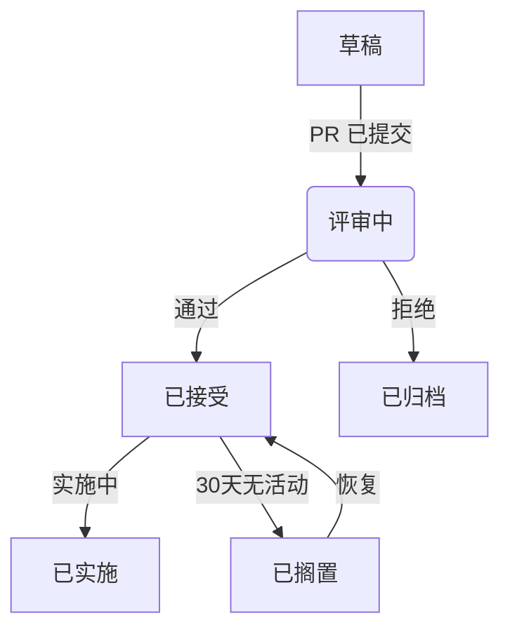

# UI-TARS-desktop RFC（征求意见稿）

大多数变更（包括 Bug 修复和文档改进）可以通过标准的 GitHub Pull Request 来处理。但涉及跨平台考量（Windows/macOS/Linux）的重大技术变更，应遵循本 RFC 流程，以确保系统化的设计评审。

## 何时需要发起 RFC

涉及以下变更时，应考虑发起 RFC：

- 架构层面的修改
- 原生 API 集成
- 跨平台行为变更
- 重大性能优化
- 安全敏感的实现
- 破坏性 API 变更

## RFC 生命周期

### 1. 预讨论

- 在 GitHub Discussion 中开启讨论帖，进行初步概念验证
- 识别核心维护者（@提及平台专家）

### 2. 草稿提交

1. Fork https://github.com/bytedance/UI-TARS-desktop
2. 将 `rfcs/template.md` 复制为 `rfcs/drafts/000-feature-name.md`
3. 提交带有 [WIP] 前缀的草稿 PR

### 3. 技术评审阶段

- 平台负责人评审以下内容：
  - Windows 兼容性
  - macOS 安全影响
  - Linux 打包影响
- 必须完成以下检查清单：
  - [ ] 性能分析
  - [ ] 跨平台测试策略
  - [ ] 错误处理文档
  - [ ] 二进制体积影响

### 4. 最终评论期

- 冻结功能范围
- 处理最终评审意见
- 需要 2/3 维护者批准（至少包含一位平台专家）

### 5. 实施跟踪

- 通过后：
  - 创建包含平台特定任务的跟踪 Issue
  - 标记目标版本里程碑
  - 分配平台实施负责人

### 状态流转

## 相比原始流程的主要修改

1. 增加了平台专家评审要求
2. 延长了跨平台分析的评审周期
3. 强制要求平台特定检查清单
4. 增加了带责任分配的实施跟踪
5. 增加了搁置状态用于资源管理
6. 增加了可视化流程图

## 实施规则

- RFC 作者享有实施优先权
- 平台特定实施必须包含：
  - Windows：MSI 安装程序兼容性测试
  - macOS：公证验证
  - Linux：Snap/Flatpak 打包检查
- 原生模块需要进行二进制体积监控

## 参考

灵感来源：

- [Electron RFC 流程](https://www.electronjs.org/blog/rfc-process)
- [React Native 架构决策](https://github.com/react-native-community/discussions-and-proposals)